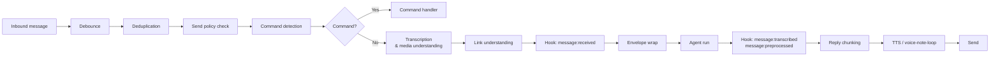

# Auto-Reply Pipeline

The auto-reply pipeline is the layer that turns every inbound channel message into a structured agent run and reply. It owns message normalization, deduplication, media transcription, command detection, model routing, reply chunking, and send policy. All channels — Telegram, WhatsApp, Discord, Slack, Signal, iMessage, and plugin-registered channels — feed through this shared pipeline; only the final delivery step is channel-specific.

## Pipeline stages



**Debounce.** Multiple messages arriving in quick succession from the same sender can be coalesced into a single agent turn. The debounce window is set via `messages.inbound.debounceMs` (global) or `messages.inbound.byChannel.<channelId>` (per channel). When debounce is zero or disabled, each message triggers its own dispatch immediately.

**Deduplication.** Before any work begins, each inbound context is checked against a short-lived in-memory deduplication key derived from the session key and message id. Duplicate deliveries from the same provider are silently dropped.

**Send policy check.** If the session's send policy is `deny`, the message is logged and discarded without invoking the agent. Policy is set per-session via the `/send` command or via config. See [Send policy](#send-policy).

**Command detection.** The normalized message body is matched against the built-in command registry and any plugin-registered commands. A control command (e.g. `/reset`, `/model`) bypasses the agent entirely; the command handler runs and returns a reply directly.

**Transcription and media understanding.** Audio and image attachments are processed before the message body reaches the agent. Audio files produce a transcript that is injected into `BodyForAgent`; images produce a description. Both are applied in parallel where possible.

**Link understanding.** URLs embedded in the message body are optionally fetched and summarized before the body is sent to the agent.

**Hook events.** After transcription and media understanding complete, `message:transcribed` fires (audio only) and `message:preprocessed` always fires. See [Hook events](#hook-events).

**Envelope wrap.** The normalized body is wrapped with a metadata header: `[Channel From Timestamp] body`. The format is controlled by `agents.defaults.envelopeTimezone`, `agents.defaults.envelopeTimestamp`, and `agents.defaults.envelopeElapsed`.

**Agent run.** The finalized message context is passed to `getReplyFromConfig`, which resolves session state, system prompt, model, and runs the agent loop. Directives embedded inline (e.g. `/model gpt-4o` or `/think high`) are extracted from the message before the loop starts.

**Reply chunking.** Agent output is split into platform-sized chunks before delivery. The default chunk limit is 4 000 characters. You can override it per channel with `channels.<id>.textChunkLimit`. The `chunkMode` setting (`"length"` or `"newline"`) controls whether splits happen at length boundaries only, or at paragraph/block boundaries. In `newline` mode, the chunker prefers paragraph/block boundaries and packs as many complete paragraphs as fit into each message up to `textChunkLimit`, falling back to length-based splitting only when a single block exceeds the limit. Fenced code blocks and tables are kept intact. Set `chunkNewlinePacking: false` to restore one message per paragraph (the pre-packing behaviour). Default: `true`.

**TTS / voice-note-loop.** If TTS is configured and `tts.auto` triggers, a voice note is synthesized and attached to the reply. When `tts.voiceNoteLoop` is `"enabled"`, a voice-note inbound triggers a voice-note reply with the text suppressed. See [Voice note loop](#voice-note-loop).

**Send.** Final payloads are dispatched through the `ReplyDispatcher`, which serializes concurrent replies and shows typing indicators while the agent runs.

## Hook events

Plugins and hook files can subscribe to these `message:*` events. All are fired fire-and-forget; they do not block the pipeline.

| Event                  | Stage                                          | Context fields                                                                                                                                                                                                                  | Notes                                                             |
| ---------------------- | ---------------------------------------------- | ------------------------------------------------------------------------------------------------------------------------------------------------------------------------------------------------------------------------------- | ----------------------------------------------------------------- |
| `message:received`     | After deduplication, before command check      | `from`, `content`, `timestamp`, `channelId`, `accountId`, `conversationId`, `messageId`, `metadata`                                                                                                                             | Fires for every non-duplicate inbound message, including commands |
| `message:transcribed`  | After audio transcription                      | `from`, `to`, `body`, `bodyForAgent`, `transcript`, `timestamp`, `channelId`, `conversationId`, `messageId`, `senderId`, `senderName`, `senderUsername`, `provider`, `surface`, `mediaPath`, `mediaType`                        | Only fires when `ctx.Transcript` is set (audio message)           |
| `message:preprocessed` | After all media + link understanding completes | `from`, `to`, `body`, `bodyForAgent`, `transcript?`, `timestamp`, `channelId`, `conversationId`, `messageId`, `senderId`, `senderName`, `senderUsername`, `provider`, `surface`, `mediaPath`, `mediaType`, `isGroup`, `groupId` | Always fires (even for text-only messages with no transcript)     |

Hooks are registered via `api.registerHook(event, handler, opts)` in a plugin, or as hook files using event keys `message:received`, `message:transcribed`, and `message:preprocessed`. See [Hooks](/automation/hooks) for the full hook authoring guide.

Example — log every transcribed voice message:

```ts
export default function (api) {
  api.registerHook(
    "message:transcribed",
    async (event) => {
      const ctx = event.context as { transcript: string; channelId: string };
      api.logger.info(`[${ctx.channelId}] transcribed: ${ctx.transcript}`);
    },
    { name: "my-plugin.log-transcriptions" },
  );
}
```

## Command registry

The command registry maps text aliases (e.g. `/reset`, `/model`, `/think`) and native slash commands (Discord, Telegram) to handler functions. Built-in commands are defined in `src/auto-reply/commands-registry.data.ts`. The complete list includes:

| Category   | Commands                                                                                                                                                  |
| ---------- | --------------------------------------------------------------------------------------------------------------------------------------------------------- |
| Status     | `/help`, `/commands`, `/status`, `/context`, `/whoami` (`/id`)                                                                                            |
| Session    | `/reset`, `/new`, `/stop`, `/compact`, `/session`                                                                                                         |
| Options    | `/model`, `/models`, `/think` (`/thinking`, `/t`), `/verbose` (`/v`), `/reasoning` (`/reason`), `/elevated` (`/elev`), `/exec`, `/usage`, `/queue`        |
| Management | `/config`, `/debug`, `/allowlist`, `/approve`, `/send`, `/activation`, `/subagents`, `/kill`, `/steer` (`/tell`), `/acp`, `/focus`, `/unfocus`, `/agents` |
| Media      | `/tts`                                                                                                                                                    |
| Tools      | `/skill`, `/bash`, `/restart`                                                                                                                             |

Commands are matched in two modes: **text** (the message body equals `/commandname`) and **native** (a Telegram, Discord, or Slack native slash command). Some commands are text-only (e.g. `/bash`, `/allowlist`); others are native-only; most support both.

**Plugin commands.** Plugins can register commands via `api.registerCommand({ name, description, handler })`. Plugin commands execute before built-in commands and before the agent. See [Register auto-reply commands](/tools/plugin#register-auto-reply-commands).

**Enabling/disabling commands.** `/config` and `/debug` can be restricted via `commands.config` and `commands.debug` config flags. The `/bash` command is gated by `commands.bash`.

**Text command normalization.** The registry normalizes colon syntax (`/model:gpt-4o` → `/model gpt-4o`) and Telegram bot-username suffixes (`/reset@mybot` → `/reset`) before matching.

## Send policy

The send policy controls whether a reply is delivered to the channel. There are two runtime values: `allow` (default) and `deny`.

You can toggle the policy mid-conversation:

```text
/send off     → deny  (block replies)
/send on      → allow
/send inherit → reset to config default
```

The policy is persisted in the session store and read by `resolveSendPolicy` in `src/sessions/send-policy.ts` at dispatch time. When `deny` is active, the agent still runs (unless you also `/stop` the run), but no output is delivered. This is useful for observation mode: you can watch what the agent would say without it replying to your contacts.

Config can set a default policy per-session via the session store; there is no global `sendPolicy` config key — the policy is always a per-session runtime state controlled through `/send`.

## Voice note loop

`voiceNoteLoop` closes the voice ↔ voice loop: when the user sends a voice message, OpenClaw replies with a voice message instead of text.

Configure it under `tts`:

```json5
{
  tts: {
    auto: "inbound", // trigger TTS when the inbound message is audio
    voiceNoteLoop: "enabled", // "disabled" | "enabled" | "both"
  },
}
```

Modes:

- `"disabled"` (default): The pipeline ignores whether the inbound message was audio; TTS auto-mode behaves normally.
- `"enabled"`: When an inbound audio message triggers TTS, the text is suppressed and only the synthesized voice note is delivered.
- `"both"`: When an inbound audio message triggers TTS, both the text reply and the voice note are delivered.

`voiceNoteLoop` is only active on channels that support audio outbound delivery. Telegram and WhatsApp both support voice-note delivery. Discord supports TTS via the `/tts` command path but not native voice note send. Other channels fall back to text delivery.

The relevant implementation is in `src/auto-reply/reply/dispatch-from-config.ts` (`applyVoiceNoteLoopPolicy`).

## Heartbeat

Heartbeat runs are periodic background agent turns that fire independently of inbound messages. They are configured under `agents.defaults.heartbeat` (or per-agent under `agents.list[*].heartbeat`).

```json5
{
  agents: {
    defaults: {
      heartbeat: {
        every: "30m", // interval (default: 30m)
        target: "last", // delivery target
        prompt: "", // override the default prompt
        lightContext: true, // bootstrap from HEARTBEAT.md only
      },
    },
  },
}
```

**Delivery targets.** The `target` field controls where heartbeat output is sent:

| Value              | Behavior                                                 |
| ------------------ | -------------------------------------------------------- |
| `"none"` (default) | Run silently; no output is delivered                     |
| `"last"`           | Deliver to the most recent conversation for this session |
| `"whatsapp"`       | Deliver to WhatsApp (requires `to` field)                |
| `"telegram"`       | Deliver to Telegram (requires `to` field)                |
| `"discord"`        | Deliver to Discord (requires `to` field)                 |
| Any channel id     | Deliver to that channel plugin (requires `to` field)     |

**Suppressing empty heartbeats.** If the agent replies with `HEARTBEAT_OK` (or a short acknowledgement under `ackMaxChars` characters, default 300), the pipeline strips the token and suppresses delivery. This prevents noise when there is nothing to report.

**Heartbeat prompt.** The default prompt is: `"Read HEARTBEAT.md if it exists (workspace context). Follow it strictly. Do not infer or repeat old tasks from prior chats. If nothing needs attention, reply HEARTBEAT_OK."` Override it with `heartbeat.prompt`.

For a comparison between heartbeats and cron jobs, see [Heartbeat vs Cron](/automation/cron-vs-heartbeat).

## Troubleshooting

**Message received but no reply.**

1. Check `openclaw channels status --probe` — confirm the channel is connected and the session key resolves.
2. Check the gateway log for `send_policy_deny` — the session's send policy may be `deny` (run `/send on` from that conversation).
3. Check whether a debounce is swallowing rapid messages: lower or zero `messages.inbound.debounceMs`.
4. Confirm the session's allowlist includes the sender (`/allowlist list`).
5. Check for a `duplicate` skip in the log — the same message id may have been delivered twice by the provider.

**Reply sent, but immediately followed by an unexpected heartbeat.**

Heartbeats fire on a timer regardless of recent activity. If you want heartbeats to pause when a conversation is active, use `heartbeat.activeHours` to restrict the window, or set `heartbeat.target: "none"` and trigger heartbeats only from cron jobs that check session state. See [Heartbeat vs Cron](/automation/cron-vs-heartbeat).

**Media attachment not understood.**

Verify that a media-understanding provider is configured (e.g. `tools.media.audio` for audio, or a vision-capable model for images). Audio transcription requires Whisper or a compatible provider. Check the gateway log for `media-understanding` errors. If the attachment arrives as a URL rather than a local file, confirm that `tools.media.downloadMedia` is enabled so the pipeline can fetch it before processing.

**Command not detected.**

Run `/commands` in the conversation to list active commands. Check whether text commands are disabled for this surface (`commands.text: false` combined with a native-command surface like Discord). Verify that the command body starts with `/` after trimming — the normalizer strips colon syntax and bot-username suffixes but will not match a command buried in prose. If you added a plugin command, confirm the plugin loaded (`openclaw plugins list` and check for errors).

## Related

- [Hooks](/automation/hooks)
- [Cron jobs](/automation/cron-jobs)
- [Heartbeat vs Cron](/automation/cron-vs-heartbeat)
- [Agent loop](/concepts/agent-loop)
- [Sessions](/concepts/session)
